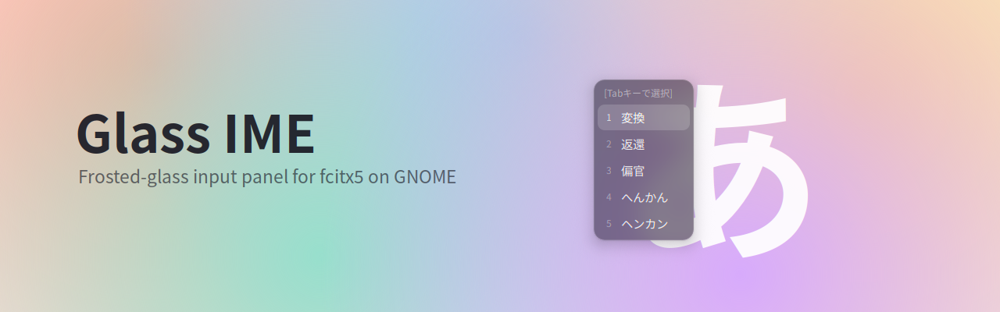
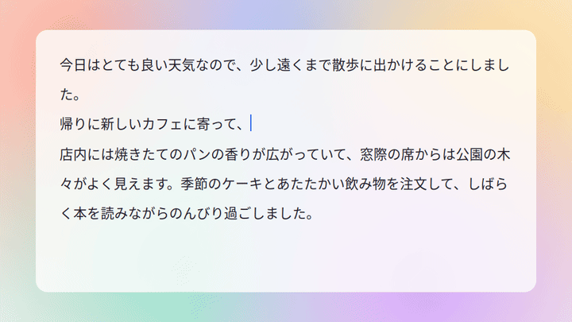
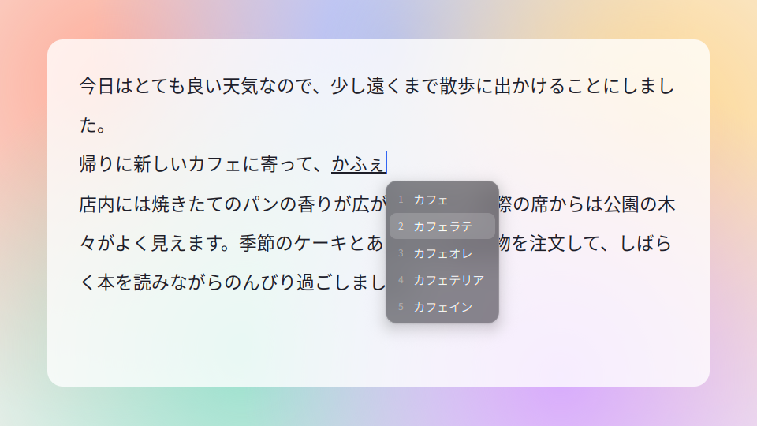
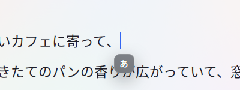

A GNOME Shell extension that draws the fcitx5 candidate window and the input method indicator as frosted glass: a live blur of whatever is behind it, a flat translucent tint, a hairline border and a soft shadow.



## Features

- **Candidate window**: the glass panel follows the cursor and smoothly grows and shrinks as the candidate list changes while you type or page through it. Text is laid out at its final size and clipped by the glass mid-animation, never ellipsized.

  

- **Dictionary panel**: when mozc has a dictionary entry for the selected candidate (「直りました」 → 直る), its meaning appears in a glass panel beside the candidate window, as on macOS.

- **Input mode indicator**: a small `A` / `あ` badge appears under the cursor when you switch input methods, e.g. with the Zenkaku/Hankaku key.

  

- **Top bar status**: the current input mode, with a menu to switch input methods or open the fcitx5 settings. It replaces the fcitx5 tray icon, which fcitx5 hides while this panel is active.

## How it works

fcitx5 ships a `kimpanel` addon that hands the whole input panel over to another process on D-Bus. The extension owns `org.kde.impanel`, so fcitx5 stops drawing its own UI and sends the candidates, the cursor position and its messages here instead.

GNOME Shell's background blur cannot be clipped to rounded corners. The extension therefore clones the wallpaper and the windows behind the panel, blurs the clones, and cuts the result to a rounded rectangle with a small GLSL shader. The blur is live and follows whatever changes underneath.

## Requirements

- GNOME Shell 50 (tested on Ubuntu 26.04 with Wayland)
- fcitx5 with the kimpanel addon (part of `fcitx5-modules` on Debian and Ubuntu)
- [Bun](https://bun.sh) to build

## Install

```sh
git clone https://github.com/tomocrafter/glass-ime.git
cd glass-ime
bun install
bun run build
ln -s "$PWD/dist" ~/.local/share/gnome-shell/extensions/glass-ime@tomo
```

Log out and back in so that GNOME Shell picks up the new extension, then enable it:

```sh
gnome-extensions enable glass-ime@tomo
```

User extensions must be allowed: `gsettings get org.gnome.shell disable-user-extensions` should print `false`.

fcitx5 switches to the glass panel as soon as the extension runs. Disable the extension to get the classic fcitx5 UI back.

## Customize

Colors, sizes and spacing live in [`stylesheet.css`](stylesheet.css):

| Selector                        | Controls                     |
| ------------------------------- | ---------------------------- |
| `.glass-ime-surface`            | Glass tint and border        |
| `.glass-ime-shadow`             | Drop shadow                  |
| `.glass-ime-candidate.selected` | Selected candidate           |
| `.glass-ime-indicator-text`     | Size of the `A` / `あ` badge |

Blur strength, corner radius and saturation are options of `GlassPanel` in [`src/lib/ui/glassPanel.ts`](src/lib/ui/glassPanel.ts).

## Development

```sh
bun run build   # compile to dist/
bun run check   # type check, oxlint and oxfmt --check
bun run format  # oxfmt
bun run reload  # disable and re-enable the extension
bun run capture # re-record the images in docs/
```

GJS caches modules for the lifetime of GNOME Shell, so `extension.ts` imports a fresh copy of `lib/` on every enable. After `bun run build`, `bun run reload` picks up the new code without restarting the shell. Only changes to `extension.ts` itself need a restart.

| Path                    | Responsibility                                         |
| ----------------------- | ------------------------------------------------------ |
| `src/extension.ts`      | Extension entry point and reloading loader             |
| `src/lib/glassIme.ts`   | Wires the D-Bus service, the panel state and the UI    |
| `src/lib/kimpanel/`     | kimpanel protocol types and the D-Bus service          |
| `src/lib/panelState.ts` | Turns protocol events into what the panel should show  |
| `src/lib/placement.ts`  | Cursor coordinates and popup placement                 |
| `src/lib/ui/`           | Glass panel, blur backdrop, candidates, badge, top bar |
| `tools/capture/`        | Scripted scenes that record the README images          |

### Updating the README images

`bun run capture` replays scripted scenes against the running extension and rewrites the banner, screenshots and demo GIF in `docs/`. Pass scene names to record only some of them, e.g. `bun run capture demo`. Scenes live in [`tools/capture/scenes.ts`](tools/capture/scenes.ts).

It needs a GNOME session with the extension enabled, the Noto Sans CJK JP font, the GStreamer PipeWire plugin and `ffmpeg`. The scenes are recorded through Mutter's ScreenCast API, and the stage window runs on XWayland so that it can be placed on screen. A window appears in the middle of the primary monitor while it records; don't type until it finishes, or real fcitx5 updates will mix into the scenes.

## License

[GPL-2.0-or-later](LICENSE)
